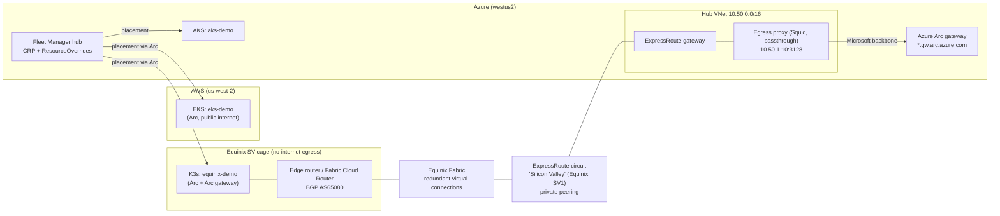

# One fleet: AKS, EKS, and Kubernetes at Equinix (private over ExpressRoute)

**Azure Kubernetes Fleet Manager + Azure Arc + Equinix Fabric + Azure ExpressRoute.**
This is a sample repository and demo for **Microsoft Ignite 2026** (Nov 17–20, San Francisco).

The demo runs one cloud-neutral application, Google's
[Online Boutique](https://github.com/GoogleCloudPlatform/microservices-demo) `v0.10.6`, as **three
independent copies** on three Kubernetes footprints. A single Fleet Manager control plane
places all three:

| Member | Where | How it reaches Azure |
|---|---|---|
| `aks-demo` | Azure AKS (westus2) | Native Fleet member |
| `eks-demo` | AWS EKS (us-west-2) | Azure Arc over the public internet |
| `equinix-demo` | K3s on servers in an **Equinix SV** cage | Azure Arc **only over ExpressRoute**. The path is Equinix Fabric, then private peering, then the Arc gateway. The cage has **no internet egress**. |

Per-footprint differences are applied with Fleet `ResourceOverride`s selected by member labels. These
include load-balancer annotations, the storefront's "Azure / AWS / On-Premises" banner, and markers.
**The application manifests are never forked.**



## The private path

The Arc agents (and the Fleet member agent) on the Equinix cluster use an explicit **passthrough**
proxy. That proxy is reachable only across **Equinix Fabric and ExpressRoute private peering**. It
forwards only an allowlisted set of FQDNs. The core of that list is the **Azure Arc gateway's**
nine endpoints. The demo **proves** this on stage: the Azure proxy log shows Arc tunnels arriving
from Equinix node IPs, and the Equinix storefront is fetched from Azure across the circuit.
For details, see [docs/NETWORKING-EXPRESSROUTE.md](docs/NETWORKING-EXPRESSROUTE.md).

## Repository structure

```text
terraform/
  azure/              RG, hub VNet, ExpressRoute circuit (provider Equinix) + gateway + private peering,
                      egress proxy VM, AKS, Fleet Manager with hub (azapi), AKS member, optional private ACR/DNS resolver
  aws/                VPC, EKS, node group, AWS Load Balancer Controller (IRSA)
  equinix/            Equinix Fabric connections -> ExpressRoute (port | cloud_router | service_token), optional FCR + BGP
  environments/demo/  credential-free consolidated summary of all roots
  bootstrap/          optional remote state (off by default)
equinix/              runs AT Equinix: proxy-aware K3s installers, egress verifier, edge-router BGP templates
kubernetes/
  base/               cloud-neutral Online Boutique v0.10.6 (kustomize)
  fleet/              ClusterResourcePlacement + member-label reference
  overrides/          ResourceOverrides: azure | aws | equinix rules
  validation/         smoke-test Job
  equinix/            Arc Cluster Connect RBAC template
scripts/              00-09 + 99 PowerShell pipeline, demo helpers, lib/ (common, lint, secret scan, ACR import)
docs/                 architecture, networking, Equinix cluster, auth, decisions, runsheet, ops, troubleshooting, presentation
```

## Prerequisites

| Need | Why |
|---|---|
| `az` (2.88+) with `connectedk8s`, `fleet`, `arcgateway` extensions, `kubectl`, `kubelogin`, `terraform` (>= 1.9), `helm` + `aws` (for EKS), PowerShell 7 (or 5.1) | Run `make check-tools` to verify and install the az extensions |
| Azure subscription: Owner, or Contributor + User Access Administrator | AKS, Fleet, ExpressRoute, Arc, and role assignments. See [docs/AUTHENTICATION-AND-PERMISSIONS.md](docs/AUTHENTICATION-AND-PERMISSIONS.md) |
| AWS account (SSO profile recommended) | EKS |
| **Equinix**: Fabric API client ID/secret, a project, and Fabric ports in a cage in **SV** (or an FCR or service token) | Order the ExpressRoute virtual connections |
| **Servers in the Equinix cage** (Ubuntu 24.04), an edge router (or FCR), and a routed subnet (default `10.80.0.0/24`) | The Kubernetes member |
| Network reachability from your workstation to the cage's K3s API, only during onboarding | `az connectedk8s connect` (after onboarding, use Arc Cluster Connect) |

## Quickstart

```powershell
Copy-Item .env.example .env          # fill in OWNER, Equinix port UUIDs/emails, AWS_PROFILE, ...
$env:EQUINIX_API_CLIENTID = Read-Host "Equinix client ID"      # secrets live in the shell only
$env:EQUINIX_API_CLIENTSECRET = (New-Object PSCredential "x", (Read-Host "Equinix secret" -AsSecureString)).GetNetworkCredential().Password

make check-tools        # 00  tools + az extensions
make bootstrap-auth     # 00  az / aws / Equinix API / Equinix kube context
make test-access        # 01  read-only preflight (scripts/01-test-cloud-access.ps1 -RegisterProviders to register RPs)
make select-regions     # 02  Azure/AWS discovery + Equinix metro check
make plan               # 03  terraform plans (azure, aws)
make apply              # 04  BILLABLE - AKS + Fleet, EKS, ExpressRoute circuit/gateway (30-45 min), proxy
make connect-er         # 05  BILLABLE - Equinix Fabric -> ER, wait for provisioning, private peering, BGP
#                             (port origin: apply artifacts/edge-router-bgp-*.conf on your router when prompted)
#  on a cage server:  EGRESS_PROXY=<egress_proxy_url> NODE_IP=<ip> sudo -E ./equinix/k3s/install-k3s-server.sh
make connect-arc        # 06  Arc: EKS (public) + Equinix (Arc gateway + proxy over ER; gateway ~30 min first time)
make join-fleet         # 07  Fleet members + labels + hub RBAC + hub kubeconfig
make deploy-workload    # 08  Online Boutique + overrides + placement, through the hub only
make validate           # 09  smoke tests, banners, storefront over ER, BGP, Arc, Fleet -> artifacts/validation-report.*
make show-private-path  # presenter proof panel

make destroy            # 99  reverse-order teardown (waits for Equinix to release the circuit)
```

> ⚠️ **The ExpressRoute circuit bills from the moment its service key is issued** (`make apply`),
> not when Equinix provisions it. Create it only when the Equinix side is ready. Also note:
> the ER gateway (30–45 minutes), the Arc gateway (about 30 minutes), and Equinix/Microsoft provisioning
> (minutes to hours) all need to happen **days before** the session.
> See [docs/DEMO-RUNSHEET.md](docs/DEMO-RUNSHEET.md).

### Rehearsal mode (no Equinix hardware yet)

Set `ENABLE_EXPRESSROUTE=false` and point `EQUINIX_KUBE_CONTEXT` at any K3s, kind, or k3d cluster.
It can run on a laptop or a VM. The cluster joins Fleet as `equinix-demo` with `cloud=equinix` and
`connectivity=public-internet-rehearsal`, and every Fleet/override step works. No circuit, gateway,
or proxy is created. This lets you rehearse the Fleet story now and add the private path later.

Optional extras: a private ACR (Premium, about $1.67/day, plus a private endpoint) and a DNS Private
Resolver inbound endpoint. Both are off by default.

## Documentation

- [docs/ARCHITECTURE.md](docs/ARCHITECTURE.md) explains the design, the label and override model, and why the demo uses Arc gateway plus a proxy rather than Private Link.
- [docs/NETWORKING-EXPRESSROUTE.md](docs/NETWORKING-EXPRESSROUTE.md) covers ExpressRoute and Equinix Fabric step by step, in both the portal and automated forms.
- [docs/EQUINIX-CLUSTER.md](docs/EQUINIX-CLUSTER.md) covers the BYO cluster at Equinix: the K3s runbook, the AKS on bare metal option, and rehearsal mode.
- [docs/AUTHENTICATION-AND-PERMISSIONS.md](docs/AUTHENTICATION-AND-PERMISSIONS.md) lists every role and credential and explains how secrets are handled.
- [docs/DECISIONS-REQUIRED.md](docs/DECISIONS-REQUIRED.md) lists what you must decide or obtain before a real run.
- [docs/DEMO-RUNSHEET.md](docs/DEMO-RUNSHEET.md) is the Ignite runsheet: T-7 days to show time, the timed talk track, and fallbacks.
- [docs/OPERATIONS.md](docs/OPERATIONS.md) covers pause/resume, cost control, updates, and teardown.
- [docs/TROUBLESHOOTING.md](docs/TROUBLESHOOTING.md) lists known issues and their fixes, including lessons from the fleet-manager-arc-demo runs.
- [docs/PRESENTATION.md](docs/PRESENTATION.md) has the slide outline and speaker notes for the Ignite deck.

## Attribution and license

This repo deploys [Online Boutique](https://github.com/GoogleCloudPlatform/microservices-demo) by Google
(Apache-2.0), pinned to `v0.10.6` and unmodified. The infrastructure and orchestration code here is provided as-is for demonstration purposes. 