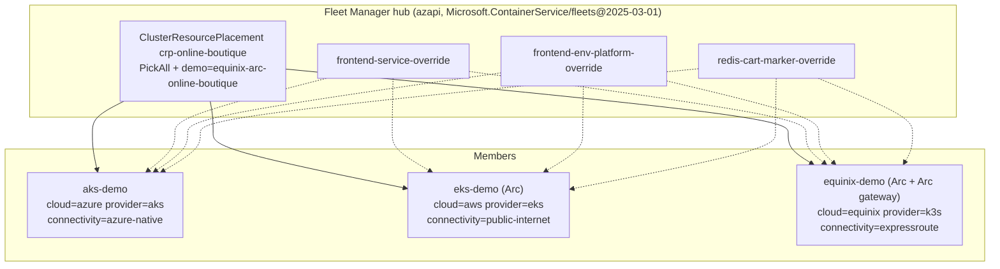
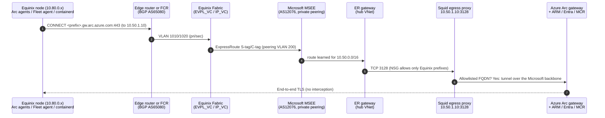

# Architecture

## Goals

- **One fleet, three footprints.** AKS (Azure), EKS (AWS), and a Kubernetes cluster in an
  **Equinix** cage are all managed by one Azure Kubernetes Fleet Manager hub.
- **Private by construction for the Equinix footprint.** Its Azure Arc and Fleet traffic leaves the
  cage **only** over Equinix Fabric and ExpressRoute private peering. The cage has no internet egress.
- **Independent clusters, shared definition.** Every member runs a complete, self-contained copy of
  Online Boutique (including its own Redis). `kubernetes/base/` is never forked. Differences between
  footprints are expressed only through label-selected Fleet `ResourceOverride`s.
- **Provable on stage.** BGP routes, Arc gateway status, proxy logs that show Equinix node IPs, and
  a storefront fetched from Azure across the circuit.
- **Repeatable and teardown-safe.** The repo runs a numbered pipeline (00–09, 99). Each step is
  idempotent and every billable step asks for confirmation.

## Non-goals

- Global traffic routing or DNS across the three storefronts. Each storefront keeps its own entry point.
- Cross-cluster service networking. Fleet doesn't support it for Arc members.
- Fleet-orchestrated Kubernetes upgrades for Arc members. These are AKS-only (see the capability table below).
- High availability inside any single footprint, and production-grade hardening of the egress proxy.
  The production alternatives are listed below.

## Components



### Capability check (Fleet member types, from Microsoft Learn, June 2026)

| Capability | AKS member | Arc-enabled member | Used here |
|---|---|---|---|
| Workload placement (CRP + overrides) | GA | **GA** | ✅ Core of the demo |
| Kubernetes/node image update runs | GA | Not supported | AKS only (update group `azure`) |
| Managed namespaces | Preview | Preview | Not used |
| DNS load balancing, cross-cluster networking | GA / Preview | Not supported | Not used |
| Behind a passthrough proxy | Not applicable | **Arc gateway required** | ✅ Equinix member |
| TLS-terminating proxy | Not applicable | **Not supported** | Squid is passthrough (CONNECT) only |

## The private path (Equinix member)



**Why this design (and not the alternatives)?**

| Option | Verdict |
|---|---|
| **Arc gateway + explicit passthrough proxy in Azure, reached over ER private peering** | ✅ **Chosen.** It's the pattern Fleet requires for proxied Arc members. It cuts the allowlist to about 9 Arc FQDNs plus the Fleet hub and image registries. The cage needs no internet at all. It's easy to prove with proxy logs. |
| Arc Private Link Scope for Kubernetes | ❌ Still **preview**. Entra ID, ARM, and MCR must still be reachable over the internet, Cluster Connect isn't supported, and there's no documented Fleet story. |
| ExpressRoute **Microsoft peering** to Azure public endpoints | ❌ Needs public NAT prefixes, route filters, and BGP communities. That's heavy for a demo, and still doesn't cover every Arc endpoint. |
| Internet egress from the cage | ❌ Defeats the purpose of the demo (it's how EKS connects, for contrast). |

**Production alternatives for the proxy VM:** Azure Firewall with explicit proxy, your existing
enterprise proxy in Azure, or a highly available Squid pair behind an internal load balancer. Arc
gateway endpoints must **not** be TLS-inspected.

**What the proxy allows** (`terraform/azure/main.tf`, `local.proxy_allowed_domains`):

| Group | Domains | Why |
|---|---|---|
| Arc gateway (always) | `.gw.arc.azure.com`, `management.azure.com`, `.obo.arc.azure.com`, `login.microsoftonline.com`, `.login.microsoft.com`, `.his.arc.azure.com`, `mcr.microsoft.com`, `.data.mcr.microsoft.com` | [Arc gateway for Kubernetes](https://learn.microsoft.com/azure/azure-arc/kubernetes/arc-gateway-simplify-networking) |
| Fleet (always) | `.azmk8s.io` | Fleet member agent to the hub API server. It isn't in the Arc gateway endpoint list. |
| Workload registries | `us-central1-docker.pkg.dev`, `registry-1.docker.io`, `auth.docker.io`, `production.cloudflare.docker.com` | Online Boutique, Redis, busybox, and K3s system images |
| K3s bootstrap | `get.k3s.io`, `update.k3s.io`, `github.com`, `.githubusercontent.com` | The installer and binary |
| Private ACR (optional) | `.azurecr.io` | Squid resolves the registry through the hub's `privatelink.azurecr.io` zone, so the image path stays private. |

Everything else is denied (`equinix/k3s/verify-egress.sh` proves it).

## Independence and failure domains

- Each member serves its own storefront from its own Redis. No request crosses clusters.
- **If ExpressRoute goes down**, the Equinix storefront keeps serving local users. Arc reports the
  cluster as `Offline` and Fleet's view of it goes stale, but nothing is uninstalled. Reconciliation
  resumes when the link returns. This makes a good Q&A answer about colocation resilience.
- If the Fleet hub is down, all three storefronts keep running. Only *changes* pause.

## Fleet model

- The **CRP** selects the `online-boutique` Namespace (and everything in it) for every member labeled
  `demo=equinix-arc-online-boutique`.
- There are three **ResourceOverrides**, one per concern, each with one rule per `cloud` label. Every
  member matches exactly one rule:

| Override | azure | aws | equinix |
|---|---|---|---|
| `frontend-service-override` (Service `frontend-external`) | Azure LB health-probe path | NLB, `internet-facing`, explicit subnets (rendered from Terraform) | No LB annotations (K3s ServiceLB on node IPs). Marks `network-path: expressroute-private-peering`, or `public-internet-rehearsal` in rehearsal mode (selected by the `connectivity` label) |
| `frontend-env-platform-override` (Deployment `frontend`) | `ENV_PLATFORM=azure` | `aws` | `onprem`, which shows the **"On-Premises"** banner |
| `redis-cart-marker-override` (Deployment `redis-cart`) | label `cloud=azure` | `aws` | `equinix` |

- `${MEMBER-CLUSTER-NAME}` (a Fleet reserved variable) stamps each Service with its member name.
- Overrides reference `placement.name: crp-online-boutique`, so edits reconcile immediately.
- The member labels are listed in `kubernetes/fleet/member-labels-reference.yaml`:
  `cloud`, `provider`, `connectivity`, `site`, `location`, `demo`, `environment`.

## Per-footprint design

| | AKS | EKS | Equinix |
|---|---|---|---|
| Kubernetes | AKS default version, Free tier | 1.35, standard support | K3s `stable` channel (pin with `K3S_VERSION`) |
| Nodes | 2x Standard_D2s_v5 | 2x t3.large on-demand | 1–3 customer servers, Ubuntu 24.04 |
| Networking | Azure CNI Overlay + Cilium (managed VNet) | VPC with public subnets, no NAT (cost) | Cage subnet `10.80.0.0/24`, default route to the edge router, **no internet** |
| Storefront entry | Azure Standard LB | NLB (AWS Load Balancer Controller) | K3s ServiceLB on node IPs. Reachable over ER. Optionally published by the hub nginx to the presenter's IP. |
| Arc | n/a (native) | `az connectedk8s connect --distribution eks` | `--distribution k3s --gateway-resource-id ... --proxy-https ...` |

## Terraform layout and cross-root sequencing

```text
terraform/azure    (circuit + gateway + proxy + AKS + Fleet)  ──service key──▶  terraform/equinix (Fabric)
        ▲                                                                             │
        └──────── re-apply with expressroute_private_peering_enabled=true ◀───────────┘
                  (set automatically once the circuit reports Provisioned)
```

- Each root is independent and declares its own providers. This avoids cross-cloud credential coupling,
  a lesson from fleet-manager-arc-demo.
- The **service key** passes from the Azure outputs (sensitive) to the Equinix root **only** through
  the process-scoped `TF_VAR_expressroute_service_key` variable inside `scripts/05`. It's never printed
  or written to tfvars.
- `expressroute_private_peering_enabled` is **derived from live circuit state** each time tfvars are
  generated. Re-running `make plan` never tears down a working peering.
- **azurerm 5.x:** the provider no longer registers resource providers implicitly. `scripts/01 -RegisterProviders` does it explicitly.
  The AKS resource now requires `node_provisioning_profile` (set to `Manual`).
- **ER gateway:** `ErGwScale` with min/max = 1 scale unit. Azure auto-assigns and manages the
  management public IP.
- **Egress proxy configuration** is applied through `azurerm_virtual_machine_run_command`. Changing the
  allowlist or storefront upstreams re-runs the script in place and never recreates the VM, so
  the proxy IP baked into the Arc agents stays stable.

## Security posture

- The cage accepts no inbound connections. Operators use **Arc Cluster Connect** (`scripts/demo-arc-proxy.ps1`),
  with Kubernetes RBAC bound to their Entra object ID.
- The egress proxy accepts connections only from Equinix prefixes and the hub VNet (NSG plus Squid ACL).
  There's no inbound SSH, because the VM is managed through Run Command.
- Secrets aren't stored in `.env`, tfvars, or git. See [AUTHENTICATION-AND-PERMISSIONS.md](AUTHENTICATION-AND-PERMISSIONS.md).
  Terraform state contains the ER service key, the AKS kubeconfig, and the proxy VM's generated SSH key.
  State is local and gitignored. Use a remote backend with encryption beyond a single-operator demo.

## Cost choices

- A 50 Mbps **Metered** circuit ($55/month). Arc and demo traffic is tiny.
- An ErGwScale gateway pinned to 1 scale unit ($0.21/hr) instead of ErGw1AZ ($0.36/hr).
- A B2s proxy VM, the Free AKS tier, 2-node clusters, and no NAT gateway on AWS.
- Optional extras (private ACR, DNS resolver, diagnostics) are **off** by default.
- See [OPERATIONS.md](OPERATIONS.md) for pause/resume. The circuit and gateway can't be paused,
  only deleted and recreated.
